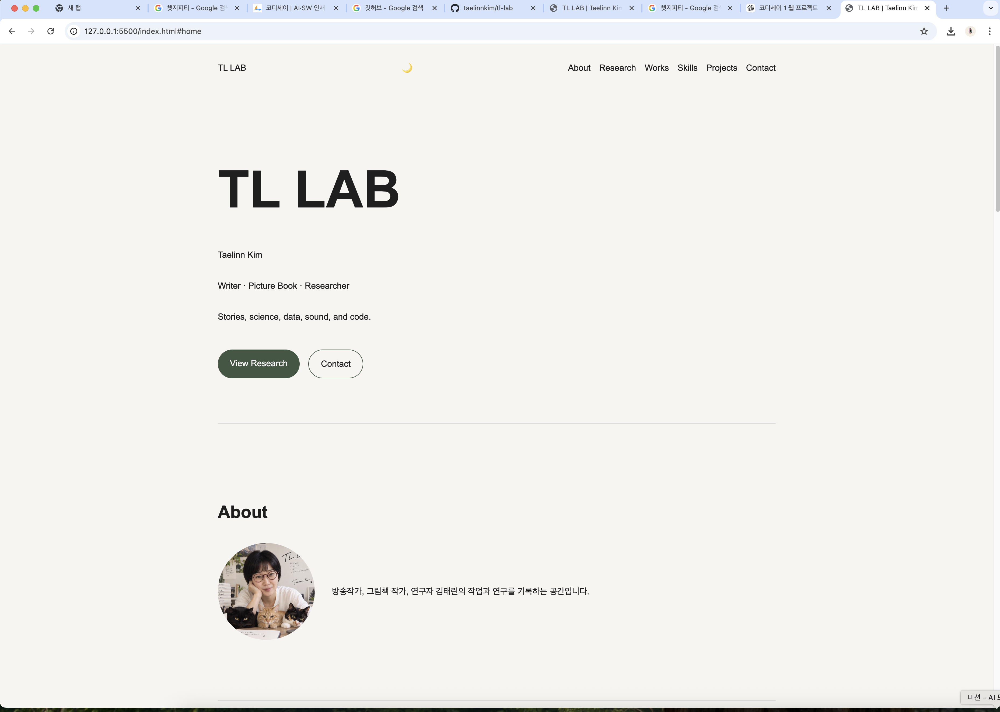
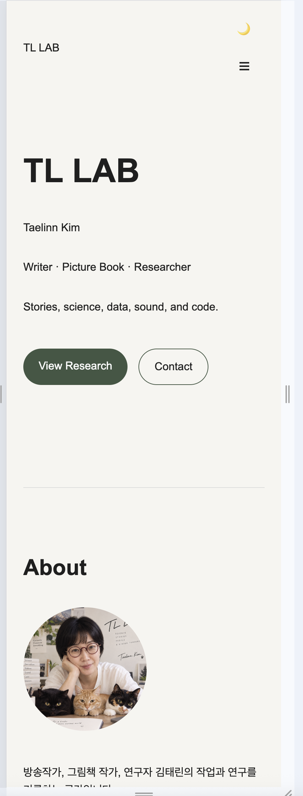
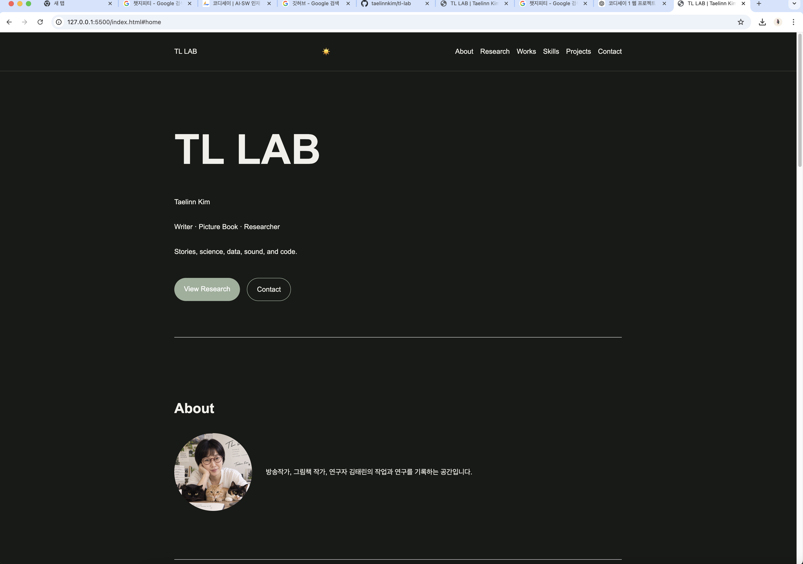

# TL LAB

김태린의 개인 연구·창작 포트폴리오 웹사이트입니다.

방송작가, 그림책 작가, 연구자로서의 작업과  
KAIST 과학저널리즘, 구상나무 데이터 소니피케이션 연구,  
그리고 코딩 학습 과정을 한 공간에 담기 위해 제작했습니다.

순수 HTML, CSS, JavaScript만을 사용하여 반응형 웹사이트를 구현하고,  
사용자 이벤트 → 상태 변경 → DOM 업데이트의 흐름을 직접 구현했습니다.

---

## Live Site

https://taelinnkim.github.io/tl-lab/

---

## Features

### Responsive Web Design

- Mobile First 방식
- Tablet breakpoint: `768px`
- Desktop breakpoint: `1024px`
- 모바일 환경에서 햄버거 메뉴 제공
- 화면 크기에 따라 About 및 Projects 레이아웃 자동 변경

### Interactive UI

- 햄버거 메뉴 열기 / 닫기
- 부드러운 섹션 이동
- 스크롤 탑 버튼
- 스크롤에 따른 Header 스타일 변경
- 다크 모드 토글
- 다크 모드 설정 `localStorage` 저장
- Intersection Observer 기반 스크롤 애니메이션
- CTA 버튼 및 카드 hover / transition 효과

### GitHub Projects

GitHub REST API를 사용하여 GitHub 저장소 목록을 동적으로 가져옵니다.

Endpoint: `https://api.github.com/users/taelinnkim/repos`

다음 상태를 각각 UI로 처리합니다.

- Loading
- Success
- Error
- Empty
- Retry

GitHub 데이터를 `map()`으로 HTML 카드로 변환하여 Projects 영역에 렌더링합니다.

프로젝트 검색 기능은 `Array.filter()`를 사용하여
프로젝트 이름과 설명을 기준으로 목록을 필터링합니다.

### Contact Form

- 이름, 이메일, 메시지 입력
- 필수값 검사
- 이메일 형식 검사
- 입력 필드별 에러 메시지 표시
- `input` 이벤트를 이용한 에러 상태 해제
- 성공 / 실패 메시지 표시
- `event.preventDefault()`를 이용한 기본 제출 동작 제어

### Real Contact Submission

보너스 기능으로 Formspree를 연동하여  
Contact Form에서 작성한 문의가 실제 이메일로 전송되도록 구현했습니다.

폼 입력값이 유효성 검사를 통과한 경우에만 Formspree API로 전송됩니다.

---

## Sections

- Hero
- About
- Research
- Works
- Skills
- Projects
- Contact
- Footer

---

## Research

### Korean Fir Sonification

기후변화에 따른 구상나무 숲의 변화를  
데이터와 소리를 통해 탐구하는 연구를 진행하고 있습니다.

데이터 소니피케이션을 통해 과학 데이터를  
시각뿐 아니라 청각적으로 경험할 수 있는 방법을 탐색합니다.

---

## Works

TL LAB은 앞으로 다음 작업을 아카이빙하는 개인 연구·창작 공간으로 확장할 예정입니다.

- Picture Books
- Illustration
- Broadcast & Documentary
- Research
- Data Sonification
- Coding Projects

---

## Technologies

- HTML5
- CSS3
- JavaScript
- Git
- GitHub
- GitHub REST API
- GitHub Pages
- Formspree

외부 프레임워크 없이 Vanilla HTML / CSS / JavaScript로 구현했습니다.

프로젝트의 주요 상태는 `STATE` 객체에서 관리합니다.

---

## JavaScript Concepts

이 프로젝트에서 사용한 주요 JavaScript 개념입니다.

- `const`, `let`
- `querySelector`
- `querySelectorAll`
- `addEventListener`
- `classList.add()`
- `classList.remove()`
- `classList.toggle()`
- `textContent`
- `innerHTML`
- `localStorage`
- `fetch`
- `async / await`
- `try / catch`
- `map()`
- `forEach()`
- `filter()`
- 화살표 함수
- 구조분해 할당
- 템플릿 리터럴
- FormData
- Intersection Observer

---

## Event → State → Render

### Dark Mode

사용자 클릭  
→ Theme 상태 변경  
→ `data-theme` 변경  
→ CSS 변수 변경  
→ 화면 테마 변경  
→ `localStorage` 저장

### GitHub Projects

API 요청  
→ Loading 상태  
→ Success / Error / Empty 상태  
→ Projects UI 업데이트

### Contact Form

사용자 입력  
→ 유효성 검사  
→ Valid / Invalid 상태 변경  
→ 에러 메시지 표시 / 제거  
→ Formspree 전송  
→ 성공 / 실패 메시지 표시

### Scroll Interaction

사용자 스크롤  
→ 현재 스크롤 위치 확인  
→ 클래스 상태 변경  
→ Header / Scroll Top 버튼 UI 변경

### Project Search

사용자 검색어 입력  
→ `STATE.projectQuery` 변경  
→ `STATE.repositories.filter()` 실행  
→ 조건에 맞는 프로젝트만 화면에 표시

---

## Layout

### Flexbox

Navigation과 About 영역 등  
한 방향으로 요소를 정렬하는 레이아웃에 사용했습니다.

### CSS Grid

GitHub Projects 카드 영역에 사용했습니다.

`auto-fit`과 `minmax()`를 활용하여  
화면 크기에 따라 카드 수가 자동으로 조정되도록 구현했습니다.

---

## Interaction Settings

- Scroll Top Button: `300px`
- Header Style Change: `60px`
- Intersection Observer Threshold: `0.2`

---

## Responsive Breakpoints

- Mobile First
- Tablet: `768px`
- Desktop: `1024px`

---

## Project Structure

tl-lab/  
├── css/  
│   └── style.css  
├── images/  
│   ├── profile.png  
│   └── screenshots/  
│       ├── desktop.png  
│       ├── mobile.png  
│       └── dark-mode.png  
├── js/  
│   └── main.js  
├── index.html  
└── README.md

---

## Screenshots

### Desktop

### Mobile

### Dark Mode

---

## Deployment

GitHub Pages를 사용하여 배포했습니다.

https://taelinnkim.github.io/tl-lab/

---

## Author

**Taelinn Kim**

Writer · Picture Book Author · Researcher

Stories, science, data, sound, and code.

**TL LAB**